import { Head, Image } from 'mdx-deck'
import { Notes } from 'mdx-deck'
import Start from './src/Components/start'
import Source from './src/Components/source'
import Video from './src/Components/video'
export theme from './src/theme'
import Invert from './src/layouts/Invert'
import ImgLayout from './src/layouts/image'

<Head>
  <title>Fonts 2019</title>
  <link href="https://fonts.googleapis.com/css?family=Work+Sans:400,700,900" rel="stylesheet" />
  <link href="./styles.css" rel="stylesheet" />
</Head>

export default Start

<Video
  loop={true}
  src="https://cdn.jsdelivr.net/gh/signalwerk/talk.fonts2019@master/img/intro/intro.mp4"
/>

---

## *2019 · State of the Font*
# Irgendwas ist ja immer…

Schule für Gestaltung · Zürich <!-- .element: className="footer" -->

---

## **Stefan Huber** · Entwickler & Dozent
---

export default ImgLayout

\ * The production of new types  is only a ‘necessity’ within capitalism. *
### **Tschichold** · 1931

<Source>

Active Literature: Jan Tschichold and New Typography, Hyphen Press   Letter from Tschichold to Albers (8. 12. 1931)

</Source>

---

export default Invert

<Source>

Font: Polo Book · Georg Salden · 1972   Info: FF Meta · Spiekermann · 1991 | Syntax · Meier · 1968

</Source>

---

export default Invert

<Source>

Font: Lexicon · Bram de Does († 2015) · 1992

</Source>

---

export default Invert

<Source>

Font: Thesis · TheMix Plain · Luc(as) de Groot · 1994

</Source>

---

# Fonts · **2019** · *Web*

---
# ✨ Wunschliste ✨

---
## Kerning
---

export default ImgLayout

## ~1445 · Handsatz

<Source>

Bildquelle: Stefan Huber · 2018

</Source>

---
export default ImgLayout

## ~1445 · Handsatz

<Source>

Bildquelle: Stefan Huber · 2018

</Source>

---

export default Invert

## Digitalisierung

<Source>

Font: Paratype · PT Sans · Bold  

</Source>
---

export default Invert

## 1984 · Adobe PostScript

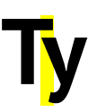

<Source>

Font: Paratype · PT Sans · Bold  

</Source>
---

export default Invert

## Globalisierung

<Source>

Font: Paratype · PT Sans · Bold

</Source>
---

export default Invert

## OpenType · 1996

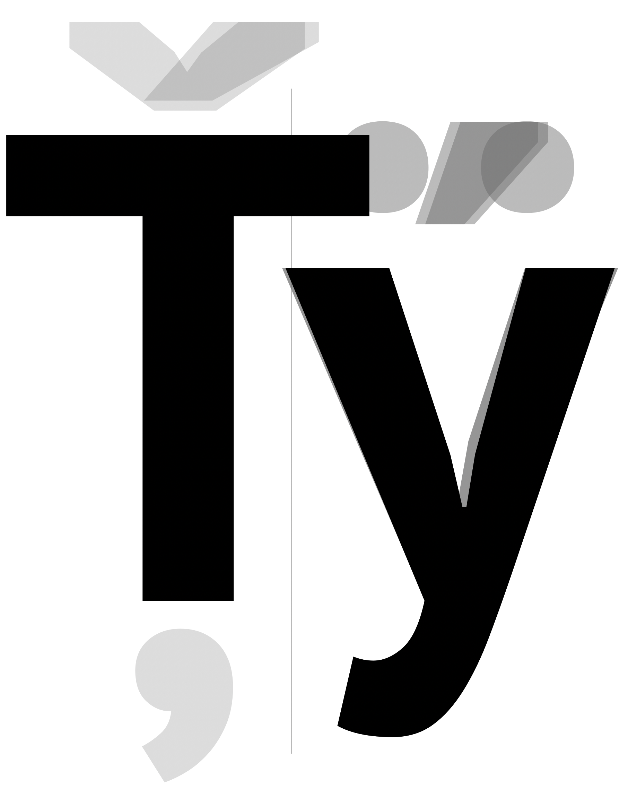

<Source>

Font: Paratype · PT Sans · Bold

</Source>
---

export default Invert

## OpenType · 1996

<Source>

Font: Paratype · PT Sans · Bold

</Source>

---

export default Invert

<Source>

Font: Adobe · Garamond Premier Pro · Regular

</Source>

---

export default Invert

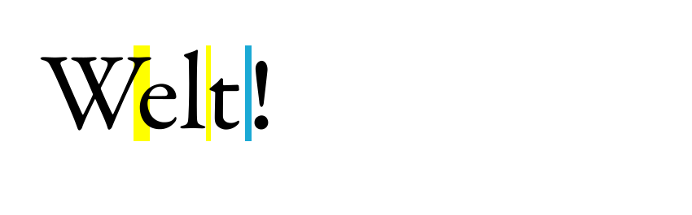

<Source>

Font: Adobe · Garamond Premier Pro · Regular

</Source>

---

export default Invert

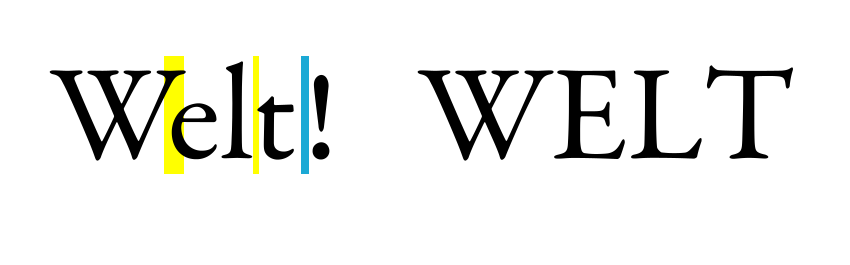

<Source>

Font: Adobe · Garamond Premier Pro · Regular

</Source>

---

export default Invert

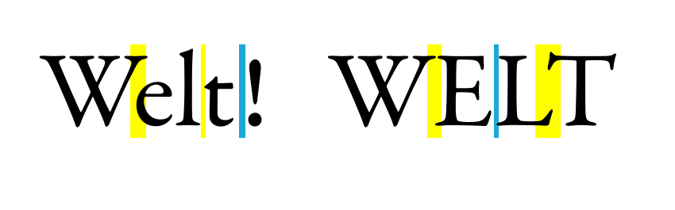

<Source>

Font: Adobe · Garamond Premier Pro · Regular

</Source>

---

export default Invert

<Source>

Font: Adobe · Garamond Premier Pro · Regular

</Source>

---

export default Invert

<Source>

Font: Adobe · Garamond Premier Pro · Regular

</Source>
---

## Kerning · **bitte mehr!**

---
## Zahlensätze
---

<iframe
  className="browser noBorder"
  src="https://signalwerk.github.io/fontkit-demo/?url=AdobeVFPrototype.otf&hideInput=true&sampleText=Typ 6917.10&fontSize=300">
</iframe>

Font: Adobe VF Prototype

---

## Zahlensätze · **bitte vier!**

---

## Optische Grössen

---
## Variable Fonts · 2016

---

<iframe
  className="browser noBorder"
  src="https://signalwerk.github.io/fontkit-demo/?url=AmstelvarAlpha-VF.ttf&hideInput=true&sampleText=HALLO&fontSize=350">
</iframe>

Font: Amstelvar Alpha

---

## Optische Grössen · **bitte ja!**

---

## Mikrotypografie

---

## Leerzeichen

---

export default Invert

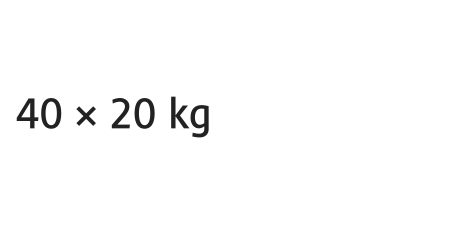

<Source>

Font:  Cast Medium · Dominique Kerber · 2011

</Source>

---

export default Invert

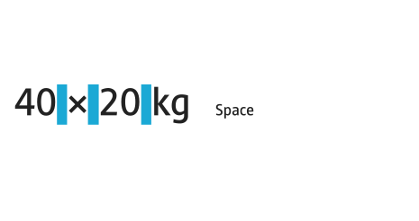

<Source>

Font:  Cast Medium · Dominique Kerber · 2011

</Source>

---

export default Invert

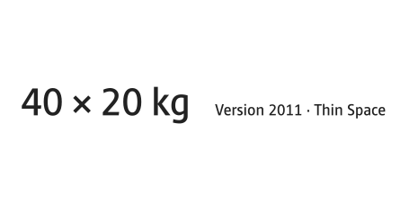

<Source>

Font:  Cast Medium · Dominique Kerber · 2011

</Source>

---

export default Invert

<Source>

Font:  Cast Medium · Dominique Kerber · 2011

</Source>

---

export default Invert

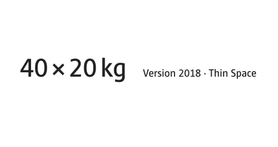

<Source>

Font:  Cast Medium · Dominique Kerber · 2018

</Source>
---

export default Invert

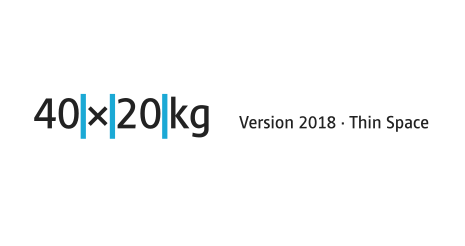

<Source>

Font:  Cast Medium · Dominique Kerber · 2018

</Source>
---

export default Invert

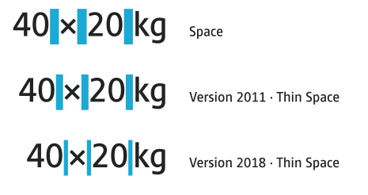

<Source>

Font:  Cast Medium · Dominique Kerber · 2011/2018

</Source>
---

export default Invert

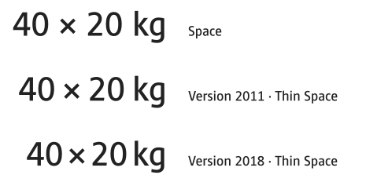

<Source>

Font:  Cast Medium · Dominique Kerber · 2011/2018

</Source>

---

export default Invert

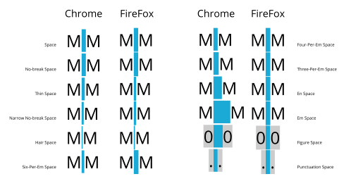

<Source>

Font:  Open Sans Regular · Steve Matteson · 2011

</Source>

---

[→ ups...](https://www.apple.com/chde/ipad-pro/specs/)

---

## Mikrotypografie · **2019!**

---

## Zeichenersetzung

---

<iframe
  className="browser noBorder"
  src="https://signalwerk.github.io/fontkit-demo/?url=AdobeVFPrototype.otf&hideInput=true&sampleText=fi fl ffi&fontSize=300">
</iframe>

Font: Adobe VF Prototype

---

export default Invert

<Video
  loop={true}
  src="https://cdn.jsdelivr.net/gh/signalwerk/talk.fonts2019@master/img/replace/SansBullshitSans/text-entry.mp4"
/>

<Source>

Font: [Sans Bullshit Sans](http://www.sansbullshitsans.com/) · Roel Nieskens · 2015

</Source>

---

export default Invert

<Video
  loop={true}
  src="https://cdn.jsdelivr.net/gh/signalwerk/talk.fonts2019@master/img/replace/Logical/slack.mp4"
/>

<Source>

Bildquelle: Slack · 2019

</Source>

---

<iframe
  className="browser noBorder"
  src="https://cdn.jsdelivr.net/gh/signalwerk/talk.fonts2019@6d66b94b7dd8bd143cae5c902761916ff0b2e60a/img/replace/Logical/SVG/cat-animation.svg">
</iframe>

Font: Logical · Edgar Walthert · 2018

---

## Zeichenersetzung · **wir werden sehen…**

---

## Lizenz

---

## Freefonts

---

<iframe
  className="browser "
  src="https://www.dafont.com/ji-amalgam.font?text=WELT&psize=l&back=theme">
</iframe>

Font: JI Amalgam · Jordan Ivey · 2012

---

<iframe
  className="browser "
  src="https://logrinto.github.io/IAD2017.schriftmuster/">
</iframe>

Font: IAD2017 · 2018

---

## Kaufen

---

## «Kaufen»

---
Verschleiss von schriften >>> Lizenzen, die ablaufen

### Ist
* Lizenz – Was passt und wem passt es nicht
* Standards – Wer will denn heute noch Standards?

Lizenz läuft aus:
https://v-fonts.com/fonts/venn-vf
https://speakerdeck.com/bramstein/line-breaking-justification-and-variable-fonts

`Your rights to use this font software expire on December 31, 2019.`

>> Your rights to use this font software expire on December 31, 2019.
https://www.monotype.com/fonts/variable-fonts

http://www.smeltery.net/fr/fontes/megalopolis-extra

---

## Zukunft

---
## Varriable Fonts · Parametrisches Design für den Endanwender
---

<iframe
  className="browser"
  src="https://logrinto.github.io/IAD2017.variable-fonts/">
</iframe>

Font: IAD2017 · 2018

---

<iframe
  className="browser noBorder"
  src="https://signalwerk.github.io/fontkit-demo/?url=AmstelvarAlpha-VF.ttf&hideInput=true&sampleText=Homburgen&fontSize=300">
</iframe>

Font: Amstelvar Alpha

---

### Ausblick
* Varriable Fonts – Parametrisches Design für den Endanwender
* OpenType 2.0?
  –– DEFAULT Zeichensatz
  –– vorward and backward compatibility
  –– color font fuckup
  –– wie die achsen zuwachsen x/y unterschiedlich

  Variabler Font
  * Varriable Fonts – Parametrisches Design für den Endanwender

---

# Zeichen >>> noto

## Sprachabdeckung

* Noto
* Globalfonts >>> Noto
* Unicode >> georgisch

chartwell

---

EXPAND

* Grafik – Verhältnis zwischen – Engeneering zu Technik
* Crazy variable fonts in color
* super variable fonts

---

OPTIONAL
* Studi-Arbeit einbauen
* Ausgabe – Darstellung von S/W-Font screen & print
* Ausgabe – Darstellung von farbigem font screen & print 4f/2f – https://www.youtube.com/watch?v=BGK_apl8SUg
* Arabisch Problem
* lokalisierte formen sind in den fonts drin!

---
# Fragen?

---

# Merci

---

## exit 0;
